# LocalAGI Architecture

This document provides a comprehensive overview of the LocalAGI architecture, covering system components, data flows, deployment patterns, and design decisions. It is intended for developers and architects working on or integrating with the project.

## Table of Contents

- [High-Level System Overview](#high-level-system-overview)
- [Component Architecture](#component-architecture)
- [Data Flow](#data-flow)
- [Backend Architecture](#backend-architecture)
- [Model Loading and Inference Pipeline](#model-loading-and-inference-pipeline)
- [API Layer Architecture](#api-layer-architecture)
- [Web UI Architecture](#web-ui-architecture)
- [Plugin and Action System](#plugin-and-action-system)
- [Connector Architecture](#connector-architecture)
- [Knowledge Base and RAG Architecture](#knowledge-base-and-rag-architecture)
- [Deployment Architecture](#deployment-architecture)
- [Scalability Considerations](#scalability-considerations)
- [Performance Bottlenecks and Optimization](#performance-bottlenecks-and-optimization)
- [Security Architecture](#security-architecture)

---

## High-Level System Overview

LocalAGI is a modular, event-driven AI agent platform written in Go. It enables users to create, configure, and manage autonomous AI agents that can interact through multiple channels (Slack, Discord, Telegram, web UI, etc.), execute actions (browse the web, search, manage GitHub issues, etc.), and maintain persistent knowledge bases.

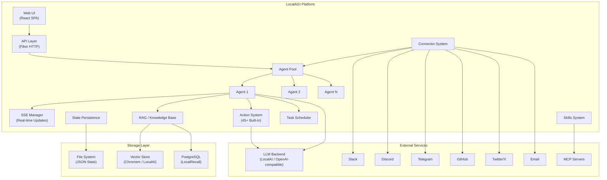

**Key architectural principles:**

- **Modular design** — Components are loosely coupled through interfaces and dependency injection.
- **OpenAI-compatible API** — The LLM integration layer uses the OpenAI SDK, allowing any compatible backend (LocalAI, OpenAI, Ollama, etc.).
- **Event-driven communication** — Agents process jobs from a channel-based queue; real-time updates flow through SSE.
- **Plugin-oriented extensibility** — Actions, connectors, dynamic prompts, MCP tools, and skills can all be added without modifying core code.

---

## Component Architecture

```mermaid
graph LR
    subgraph Core["core/"]
        direction TB
        AgentPkg["agent/<br/>Agent engine, options,<br/>identity, prompts, MCP,<br/>knowledge base, state"]
        StatePkg["state/<br/>Agent pool, config,<br/>RAG provider, compaction"]
        SchedulerPkg["scheduler/<br/>Task scheduling,<br/>JSON store"]
        ConvPkg["conversations/<br/>Conversation tracker"]
        SSEPkg["sse/<br/>SSE broadcast manager"]
        TypesPkg["types/<br/>Action, Job, State,<br/>Filter, Observable"]
    end

    subgraph Pkg["pkg/"]
        direction TB
        LLMPkg["llm/<br/>OpenAI client wrapper"]
        VectorPkg["vectorstore/<br/>Chromem, LocalAI backends"]
        LocalRAGPkg["localrag/<br/>RAG HTTP client"]
        DeepFacePkg["deepface/<br/>Face detection client"]
        ConfigPkg["config/<br/>UI metadata"]
        ClientPkg["client/<br/>HTTP client SDK"]
    end

    subgraph Services["services/"]
        direction TB
        ActionsSvc["actions/<br/>45+ action implementations"]
        ConnectorsSvc["connectors/<br/>Slack, Discord, Telegram,<br/>GitHub, IRC, Matrix, etc."]
        SkillsSvc["skills/<br/>Plugin manager,<br/>skillserver integration"]
        FiltersSvc["filters/<br/>Message filtering"]
        PromptsSvc["prompts/<br/>Dynamic prompt injection"]
    end

    subgraph WebUI["webui/"]
        direction TB
        AppHandler["app.go<br/>HTTP handlers"]
        Routes["routes.go<br/>Route registration"]
        Collections["collections/<br/>RAG management"]
        ReactUI["react-ui/<br/>React SPA (Bun build)"]
    end

    Core --> Pkg
    Services --> Core
    WebUI --> Core
    WebUI --> Services
```

### Component Responsibilities

| Component | Directory | Responsibility |
|-----------|-----------|----------------|
| **Agent Engine** | `core/agent/` | Core agent logic: LLM interaction, job execution, prompt construction, action dispatch, knowledge base lookup, MCP tool integration |
| **Agent Pool** | `core/state/` | Manages lifecycle of multiple agents, configuration loading, RAG provider setup |
| **Scheduler** | `core/scheduler/` | Cron-style task execution for reminders and periodic agent runs |
| **SSE Manager** | `core/sse/` | Broadcasts real-time observable state updates to connected web clients |
| **Type System** | `core/types/` | Shared type definitions: actions, jobs, state, observables, filters |
| **LLM Client** | `pkg/llm/` | Wraps the OpenAI Go SDK with configurable base URL, timeout, and API key |
| **Vector Store** | `pkg/vectorstore/` | Abstraction over vector databases (Chromem in-memory, LocalAI embeddings) |
| **Actions** | `services/actions/` | 45+ built-in action implementations (search, browse, GitHub, image gen, memory, etc.) |
| **Connectors** | `services/connectors/` | Input/output channel integrations (Slack, Discord, Telegram, GitHub, etc.) |
| **Skills** | `services/skills/` | Git-based plugin system using skillserver and MCP protocol |
| **Web API** | `webui/` | HTTP API (Fiber), SSE endpoints, static file serving, collections management |
| **React UI** | `webui/react-ui/` | Single-page application for agent management, chat, and configuration |

---

## Data Flow

### Chat Request Flow

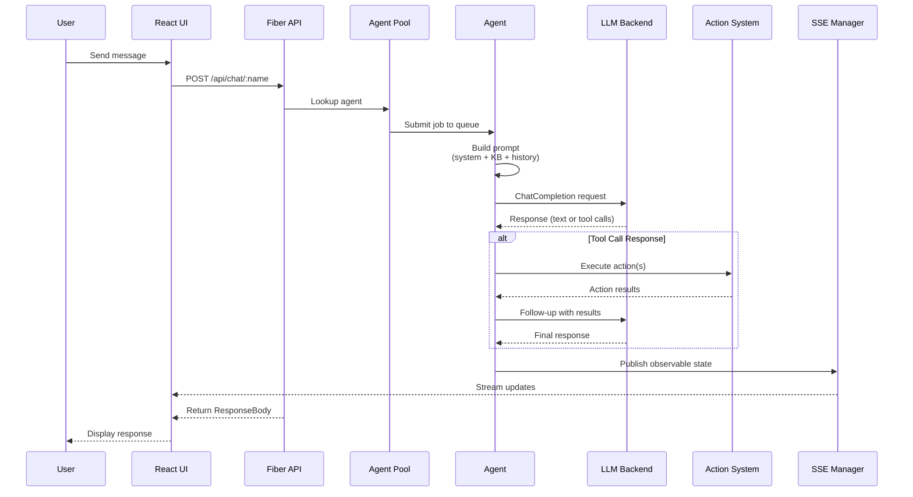

### Connector-Initiated Flow

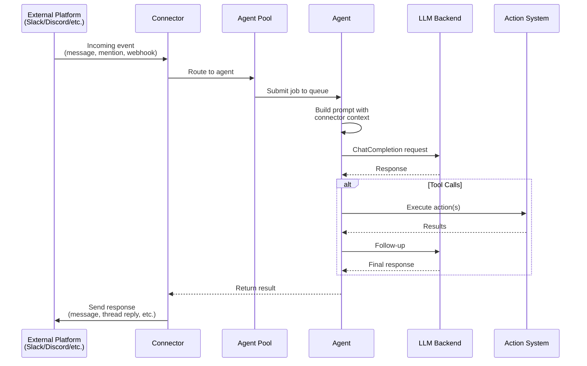

### Knowledge Base Query Flow

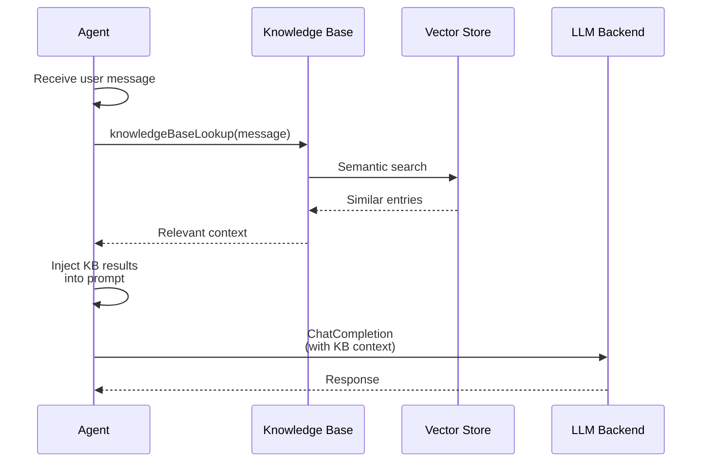

---

## Backend Architecture

### Entry Point and Initialization

The application starts in `main.go` with the following initialization sequence:

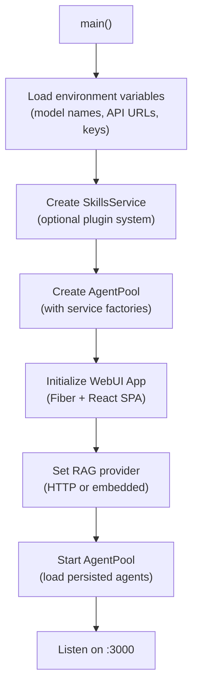

### Agent Pool and Lifecycle

The `AgentPool` (`core/state/pool.go`) manages the full lifecycle of agents:

- **Creation** — Agents are created from `AgentConfig` (60+ configuration fields) via `CreateAgent()`.
- **Persistence** — Agent configurations are serialized to `pool.json` in the state directory.
- **Recreation** — `RecreateAgent()` stops and restarts an agent with updated config.
- **Deletion** — Agents are removed from the pool and their state is cleaned up.

Each agent runs independently with its own:
- **Job queue** — A Go channel (`chan *types.Job`) for serialized job processing.
- **Conversation tracker** — Manages conversation windows per connector/session.
- **OpenAI client** — Configured with the agent's model and API settings.
- **State** — Persistent internal state (goals, memories, current task).

### Concurrency Model

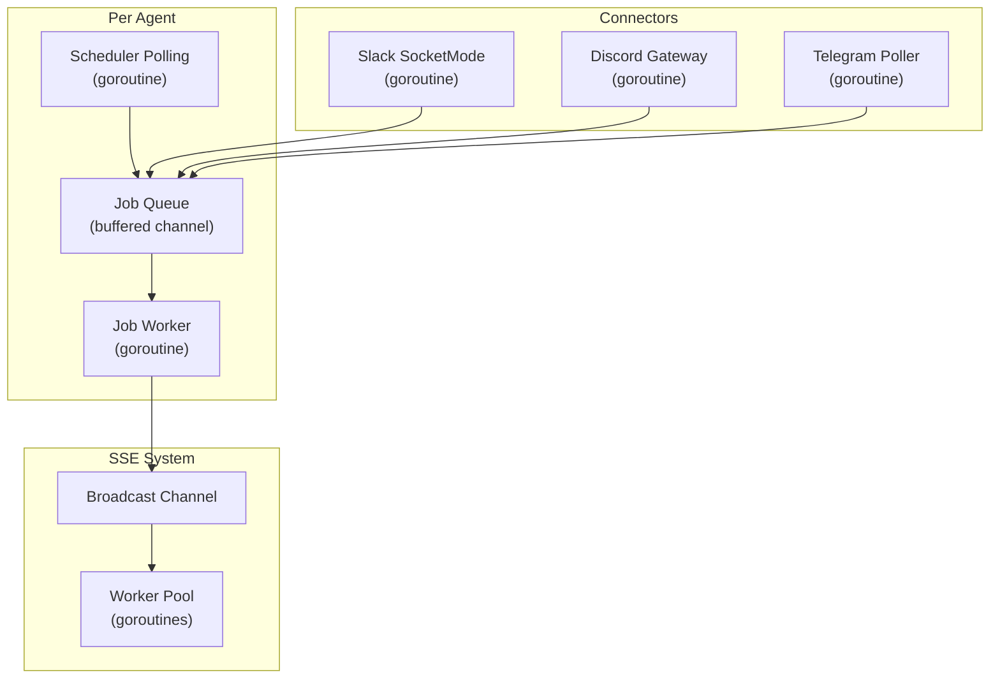

**Synchronization primitives used:**
- `chan` — Job queues, SSE broadcast channels
- `sync.Map` — Thread-safe SSE client tracking
- `sync.RWMutex` — Protecting shared agent state
- `context.Context` — Cancellation propagation for jobs and tasks

### Design Patterns

| Pattern | Usage |
|---------|-------|
| **Builder (Options)** | Agent configuration via functional options (`core/agent/options.go`) |
| **Factory** | Connector and action creation from config (`services/connectors.go`, `services/actions.go`) |
| **Observer** | SSE manager broadcasts state to subscribed clients |
| **Adapter** | RAG provider adapters (HTTP vs. in-process), KB compaction adapter |
| **Pool** | Agent pool manages multiple independent agent instances |
| **Strategy** | Swappable RAG backends (HTTP, embedded Chromem, LocalAI) |

---

## Model Loading and Inference Pipeline

LocalAGI does not load models directly. Instead, it delegates model inference to an external OpenAI-compatible API server (typically [LocalAI](https://localai.io)).

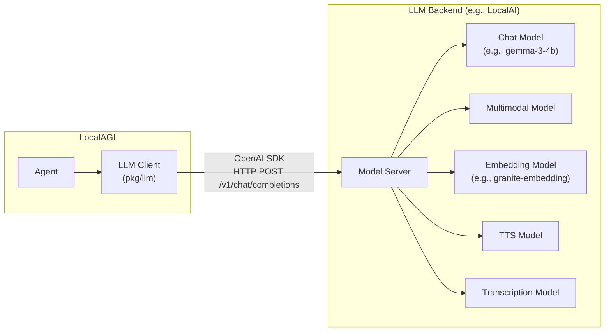

### Configuration

Models are configured via environment variables:

| Variable | Purpose | Example |
|----------|---------|---------|
| `LOCALAGI_MODEL` | Primary chat/reasoning model | `gemma-3-4b-it` |
| `LOCALAGI_MULTIMODAL_MODEL` | Vision/multimodal model | `gemma-3-4b-it` |
| `LOCALAGI_TRANSCRIPTION_MODEL` | Speech-to-text model | `whisper-1` |
| `LOCALAGI_TTS_MODEL` | Text-to-speech model | — |
| `LOCALAGI_LLM_API_URL` | LLM API base URL | `http://localai:8080` |
| `LOCALAGI_LLM_API_KEY` | API authentication key | — |
| `EMBEDDING_MODEL` | Embedding model for vector search | `granite-embedding-107m-multilingual` |

### Inference Flow

1. The agent constructs a prompt combining system instructions, identity guidance, knowledge base context, conversation history, and available tool definitions.
2. The `pkg/llm` client sends the prompt to the LLM backend via the OpenAI `ChatCompletion` API.
3. If the LLM responds with tool calls, the agent executes the corresponding actions and feeds results back.
4. This loop continues until the LLM produces a final text response or the maximum evaluation loops are reached.

---

## API Layer Architecture

The API layer is built on the [Fiber](https://gofiber.io/) web framework and serves both the REST API and the embedded React SPA.

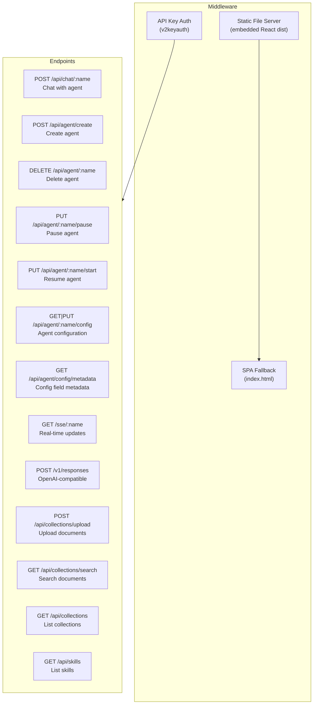

### Key Endpoints

| Method | Path | Description |
|--------|------|-------------|
| `POST` | `/api/chat/:name` | Send a message to an agent and receive a response |
| `GET` | `/sse/:name` | Subscribe to real-time agent state updates via SSE |
| `POST` | `/api/agent/create` | Create a new agent with configuration |
| `DELETE` | `/api/agent/:name` | Delete an agent |
| `PUT` | `/api/agent/:name/pause` | Pause an agent |
| `PUT` | `/api/agent/:name/start` | Resume a paused agent |
| `GET` | `/api/agent/:name/config` | Retrieve agent configuration |
| `PUT` | `/api/agent/:name/config` | Update agent configuration |
| `POST` | `/v1/responses` | OpenAI-compatible responses endpoint |
| `POST` | `/api/collections/upload` | Upload documents to a knowledge base collection |
| `GET` | `/api/collections/search` | Semantic search across collections |
| `GET` | `/api/collections` | List all collections |

### SSE (Server-Sent Events)

The SSE system (`core/sse/`) provides real-time streaming of agent observable state to web clients:

- Each agent has a dedicated SSE broadcast manager.
- The manager maintains a worker pool for parallel client distribution.
- A history buffer (10 messages) enables late-joining clients to catch up.
- Standard SSE headers are set (`Content-Type: text/event-stream`, `Cache-Control: no-cache`).

---

## Web UI Architecture

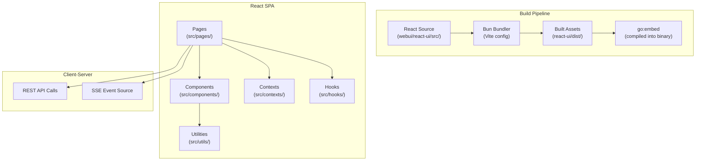

### Key Characteristics

- **Framework:** React with Bun as the build tool (Vite configuration).
- **Embedding:** The built React assets are embedded into the Go binary using `//go:embed`, creating a single deployable binary.
- **SPA Routing:** A fallback route in Fiber serves `index.html` for all unmatched paths, enabling client-side routing.
- **Real-time Updates:** The UI connects to `/sse/:name` endpoints to receive live agent state updates (current task, reasoning, tool execution status).
- **Agent Management:** The UI provides forms for creating, configuring, pausing, and deleting agents, with field metadata driven by the `/api/agent/config/metadata` endpoint.

---

## Plugin and Action System

LocalAGI has a multi-layered extensibility model:

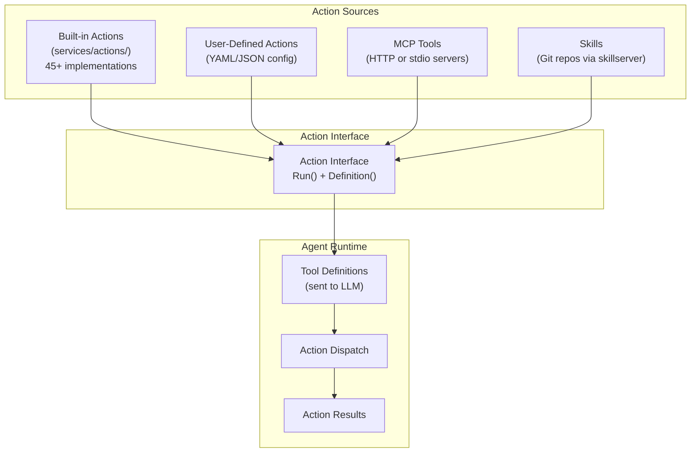

### Action Interface

All actions implement the `Action` interface (`core/types/actions.go`):

```go
type Action interface {
    Run(ctx context.Context, sharedState *AgentSharedState, params ActionParams) (ActionResult, error)
    Definition() ActionDefinition
}
```

- `Definition()` returns a JSON Schema describing the action's parameters — this is sent to the LLM as a tool definition.
- `Run()` executes the action with the provided parameters and returns a result (text and/or image).

### Built-in Actions (45+)

| Category | Actions |
|----------|---------|
| **Web** | Search, Browse, Scraper, Wikipedia |
| **GitHub** | Create/comment/list/close issues, create/review/merge PRs, manage repos |
| **Generation** | Image generation, PDF generation, Song generation |
| **Social** | Twitter posting, Email, Telegram messaging |
| **Memory** | Add/list/remove/search memory entries |
| **Scheduling** | One-time reminders, Recurring reminders |
| **System** | Shell commands, Webhooks, PiKVM control |
| **Multi-Agent** | Call other agents |

### MCP (Model Context Protocol)

Agents can integrate with external MCP servers (`core/agent/mcp.go`):

- **HTTP MCP servers** — Tools are listed via HTTP and wrapped as LocalAGI actions.
- **Stdio MCP servers** — Tools run as child processes communicating over stdin/stdout.
- MCP tools are dynamically discovered and registered as agent actions at startup.

### Skills System

The skills system (`services/skills/`) provides a Git-based plugin mechanism:

- Skills are stored in the `stateDir/skills` directory.
- The `skillserver` library manages skill discovery and indexing.
- Skills are exposed to agents via dynamic prompts (XML injection) and MCP sessions.

---

## Connector Architecture

Connectors bridge external communication platforms with the agent pool:

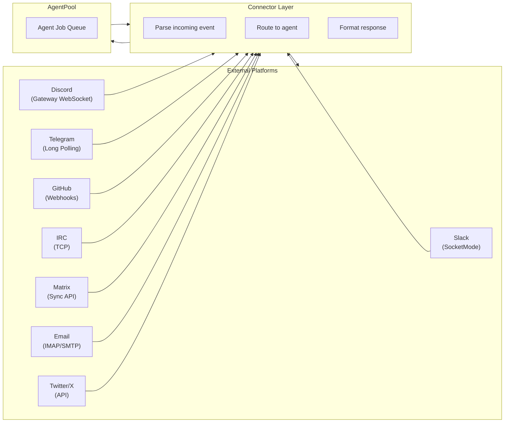

Each connector handles:

1. **Authentication** — Platform-specific credentials and token management.
2. **Event Listening** — Receiving messages, mentions, or webhook payloads.
3. **Context Mapping** — Converting platform events into agent job requests.
4. **Response Formatting** — Translating agent responses back to platform-appropriate formats (threads, reactions, file uploads, etc.).
5. **State Tracking** — Managing conversation threads and active job tracking per channel/user.

Connectors are instantiated by factory functions in `services/connectors.go` based on the `ConnectorConfig` in each agent's configuration.

---

## Knowledge Base and RAG Architecture

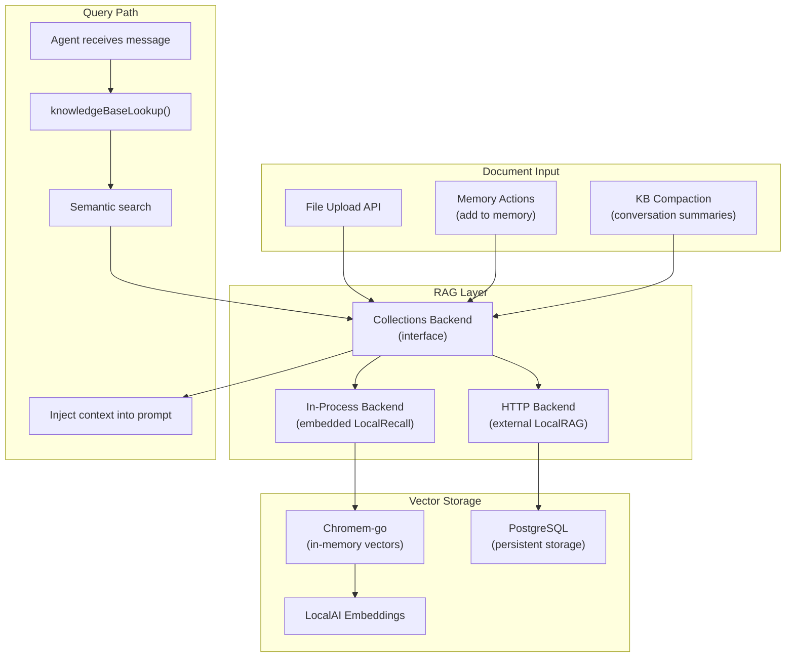

The RAG system supports two backend strategies:

- **HTTP Backend** — Delegates to an external LocalRAG service backed by PostgreSQL.
- **In-Process Backend** — Uses the `localrecall` library with Chromem-go for in-memory vector storage and LocalAI for embeddings.

Knowledge base features include:

- **Auto-search** — Automatically queries the KB on every user message.
- **KB as Tools** — Exposes KB search as an LLM tool for on-demand retrieval.
- **Compaction** — Periodically summarizes conversation history into KB entries.
- **Collections** — Named document collections with upload, search, and management APIs.

---

## Deployment Architecture

### Docker Compose (Standard)

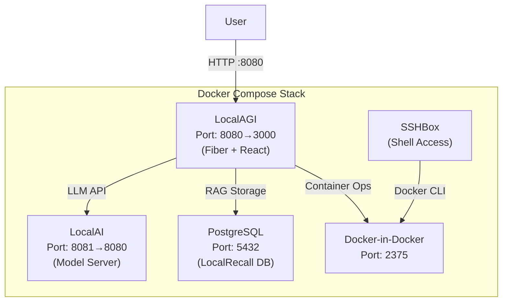

### Build Pipeline

The Docker build uses a multi-stage process:

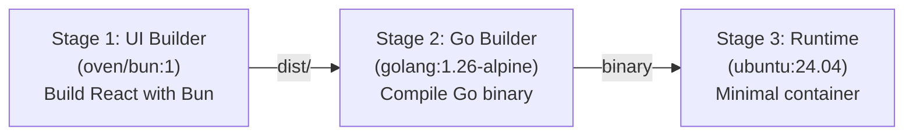

### GPU-Accelerated Variants

| Compose File | Target Hardware |
|-------------|-----------------|
| `docker-compose.yaml` | CPU only |
| `docker-compose.nvidia.yaml` | NVIDIA GPUs (CUDA) |
| `docker-compose.intel.yaml` | Intel GPUs (oneAPI) |
| `docker-compose.amd.yaml` | AMD GPUs (ROCm) |

### Deployment Patterns

**Single-node deployment (recommended for getting started):**
- All services on one machine via Docker Compose.
- LocalAI handles model serving with optional GPU acceleration.
- Suitable for development and small-scale production.

**Separated model server:**
- LocalAGI connects to a remote LocalAI instance (or any OpenAI-compatible API).
- Set `LOCALAGI_LLM_API_URL` to point to the remote server.
- Allows dedicated GPU hardware for inference while running LocalAGI on a lighter machine.

**External LLM provider:**
- Use hosted APIs (OpenAI, Anthropic via proxy, etc.) by configuring the API URL and key.
- No local GPU required.

---

## Scalability Considerations

### Current Architecture Characteristics

- **Single-process** — LocalAGI runs as a single Go process managing all agents.
- **Vertical scaling** — Add more CPU/RAM to handle more concurrent agents and jobs.
- **Agent-level parallelism** — Each agent processes jobs from its own goroutine; agents run independently.
- **Configurable parallel jobs** — The `ParallelJobs` setting controls concurrent job execution per agent.

### Scaling Strategies

| Dimension | Approach |
|-----------|----------|
| **More agents** | Increase process memory; agents are lightweight goroutines |
| **Higher throughput** | Scale the LLM backend horizontally (multiple LocalAI instances behind a load balancer) |
| **Larger knowledge bases** | Use PostgreSQL-backed RAG (LocalRecall) instead of in-memory Chromem |
| **Multiple instances** | Run separate LocalAGI instances with shared LLM backend and database |
| **Connector scaling** | Each connector manages its own connection pool; no shared state between connectors |

### Bottleneck Analysis

The primary bottleneck is typically LLM inference latency. Agent processing (prompt construction, action execution, state management) is fast relative to model inference time.

---

## Performance Bottlenecks and Optimization

### Known Bottlenecks

1. **LLM Inference Latency** — The dominant factor in response time. Each agent request involves at least one LLM call; tool-using conversations may require multiple round trips.
2. **Vector Search at Scale** — In-memory Chromem performs well for moderate datasets but may become slow with very large knowledge bases.
3. **Connector Polling** — Some connectors (Telegram, email) use polling intervals that add latency to message processing.
4. **SSE Fan-out** — Broadcasting to many simultaneous web clients can consume goroutines.

### Optimization Strategies

| Bottleneck | Mitigation |
|------------|------------|
| LLM latency | Use GPU-accelerated LocalAI; choose smaller models for latency-sensitive tasks; configure appropriate timeouts (default 150s) |
| Vector search | Switch to PostgreSQL-backed LocalRecall for large datasets; tune `KBResults` count |
| Memory usage | Enable `KB Compaction` to summarize old conversations; configure `AutoCompactionThreshold` |
| Action execution | Actions execute in parallel when the LLM requests multiple tool calls; `MaxAttempts` limits retries |
| Conversation growth | `ConversationStorageMode` and conversation window settings prevent unbounded memory growth |
| Loop detection | `LoopDetection` and `MaxEvaluationLoops` prevent runaway agent behavior |

---

## Security Architecture

### Authentication and Authorization

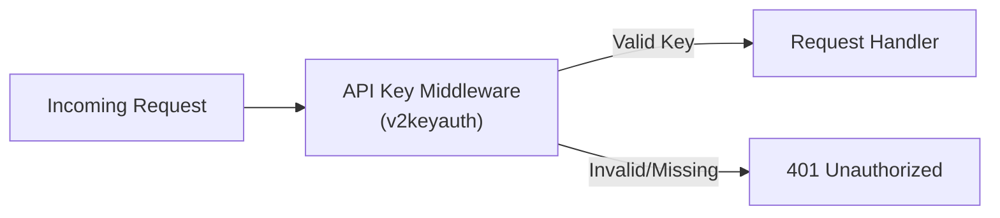

- The API is protected by API key authentication via Fiber's `v2keyauth` middleware.
- API keys are configured at startup.
- No built-in role-based access control — all authenticated requests have full access.

### Security Considerations

| Area | Current State | Recommendation |
|------|--------------|----------------|
| **API Authentication** | API key middleware | Use strong, unique keys; rotate regularly |
| **LLM API Communication** | HTTP with optional API key | Use HTTPS in production; restrict network access |
| **Action Execution** | Shell command action available | Disable shell action in production unless required; restrict with filters |
| **Connector Credentials** | Stored in agent configuration | Use environment variables or secrets management; avoid persisting tokens in plain-text config |
| **File Uploads** | Collections upload endpoint | Validate file types and sizes; sanitize filenames |
| **Docker Security** | Docker-in-Docker included | Restrict DinD access; use rootless Docker where possible |
| **State Persistence** | JSON files on disk | Protect state directory permissions; encrypt sensitive data at rest |
| **MCP Servers** | External process execution | Vet MCP servers; use stdio mode for isolation; restrict network access for HTTP MCP |

### Defense in Depth

- **Message Filters** — The filter system (`services/filters/`) can intercept and modify messages before they reach agents, enabling content moderation and input sanitization.
- **Action Allow-listing** — Only explicitly configured actions are available to each agent.
- **Evaluation Limits** — `MaxEvaluationLoops` prevents infinite tool-call loops.
- **Context Isolation** — Each agent has its own state, conversation history, and knowledge base; no cross-agent data leakage by default.
- **Network Segmentation** — In Docker deployments, services communicate over an internal network; only the LocalAGI port is exposed externally.
